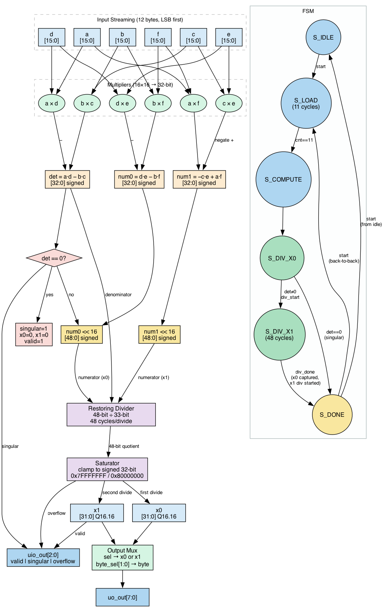

<!---
This file is used to generate your project datasheet. Please fill in the information below and delete any unused sections.

You can also include images in this folder and reference them in the markdown. Each image must be less than 512 kb in size, and the name must start with "img_".
-->

## How it works

This design solves the 2×2 linear system **Ax = b** in hardware and outputs the solution vector **x** as Q16.16 fixed-point numbers.

Given matrix A = [[a, b], [c, d]] and right-hand side b = [e, f], the hardware computes:

```
det  = a·d − b·c
x0   = (d·e − b·f) / det
x1   = (−c·e + a·f) / det
```

All six inputs are signed 16-bit integers. The outputs x0 and x1 are in **Q16.16 fixed-point format**: bits [31:16] hold the signed integer part and bits [15:0] hold the fractional part. For example, 1.5 is represented as `0x00018000`.

### Fixed-point division

Instead of computing an integer quotient, the hardware computes `(numerator << 16) / det`. This shifts 16 fractional bits into the result, giving approximately 4–5 decimal digits of precision. The representable range is ±32767.99998.

If the true result exceeds the Q16.16 range, the output is **saturated** to `0x7FFFFFFF` (max positive) or `0x80000000` (max negative) and the overflow flag is set.

### Datapath

The datapath has four stages, executed sequentially each solve:

1. **Load** — six signed 16-bit values (a, b, c, d, e, f) are streamed in over 12 clock cycles, one byte per cycle, LSB first.
2. **Compute** — det, num0, and num1 are calculated from the loaded registers in a single cycle using 16×16 multipliers and subtractors.
3. **Divide** — a sequential 48-bit restoring divider computes `(num << 16) / det`. It runs twice in series: once for x0, once for x1. Each division takes 48 clock cycles.
4. **Saturate** — the 49-bit quotient is clamped to a signed 32-bit Q16.16 value before being stored in the output registers.



Total latency is approximately **101 clock cycles** from the end of loading to a valid result (~2 µs at 50 MHz).

### FSM

The control logic is a 6-state FSM:

| State | Description |
|---|---|
| `S_IDLE` | Waits for `start` pulse; captures first input byte on the same cycle |
| `S_LOAD` | Clocks in the remaining 11 input bytes |
| `S_COMPUTE` | Computes det, num0, num1 in one cycle |
| `S_DIV_X0` | Checks for singular matrix; starts division for x0 |
| `S_DIV_X1` | Waits for x0 result; starts division for x1 |
| `S_DONE` | Captures x1; asserts `valid`; holds result until next `start` |

If det = 0 the design sets `singular = 1`, outputs zero for both x0 and x1, and skips both divisions.

### Pin summary

| Pin | Direction | Description |
|---|---|---|
| `ui_in[7:0]` | Input | Byte stream for matrix/vector inputs |
| `uio_in[0]` | Input | `start` — 1-cycle pulse to begin loading |
| `uio_in[1]` | Input | `sel` — 0 = read x0, 1 = read x1 |
| `uio_in[3:2]` | Input | `byte_sel` — selects byte 0–3 of the result |
| `uo_out[7:0]` | Output | Selected byte of x0 or x1 |
| `uio_out[0]` | Output | `valid` — result is ready and stable |
| `uio_out[1]` | Output | `singular` — det = 0, no solution |
| `uio_out[2]` | Output | `overflow` — result was saturated |

## How to use it

### Step 1 — Send inputs

Assert `start` (`uio_in[0]`) high for **one clock cycle** while presenting the first byte (`a[7:0]`) on `ui_in`. Then drop `start` and present the remaining 11 bytes on consecutive cycles:

| Cycle | `ui_in` |
|---|---|
| 0 (`start` = 1) | a[7:0] |
| 1 | a[15:8] |
| 2 | b[7:0] |
| 3 | b[15:8] |
| 4 | c[7:0] |
| 5 | c[15:8] |
| 6 | d[7:0] |
| 7 | d[15:8] |
| 8 | e[7:0] |
| 9 | e[15:8] |
| 10 | f[7:0] |
| 11 | f[15:8] |

All values are signed 16-bit two's complement, transmitted least-significant byte first.

### Step 2 — Wait for valid

Poll `uio_out[0]`. When it goes high the result is ready. This takes approximately 101 clock cycles from the start pulse.

### Step 3 — Read the result

Set `uio_in[1]` to select x0 (0) or x1 (1), and `uio_in[3:2]` to select which byte of the 32-bit result to read from `uo_out`:

| `uio_in[1]` (sel) | `uio_in[3:2]` (byte_sel) | `uo_out` |
|---|---|---|
| 0 | 00 | x0 bits [7:0] |
| 0 | 01 | x0 bits [15:8] |
| 0 | 10 | x0 bits [23:16] |
| 0 | 11 | x0 bits [31:24] |
| 1 | 00 | x1 bits [7:0] |
| 1 | 01 | x1 bits [15:8] |
| 1 | 10 | x1 bits [23:16] |
| 1 | 11 | x1 bits [31:24] |

Results remain stable until the next `start` pulse. Back-to-back solves are supported without a reset.

### Step 4 — Convert to float

```python
def from_q16(raw_32bit):
    if raw_32bit >= (1 << 31):
        raw_32bit -= (1 << 32)  # interpret as signed
    return raw_32bit / 65536.0
```

### Status flags

| `uio_out` bit | Name | Meaning |
|---|---|---|
| [0] | `valid` | Result is ready and stable |
| [1] | `singular` | det = 0; outputs are zero |
| [2] | `overflow` | Result exceeded Q16.16 range and was saturated |

## Testbench

The testbench uses Cocotb (Python) with Icarus Verilog and contains 11 self-checking tests:

**Functional correctness**
- *Identity matrix* — A = I so x = b; tests positive, negative, zero, and ±32767/−32768 edge values.
- *Diagonal matrix* — zero off-diagonals; exercises independent sign handling for each output including negative denominators.
- *Known integer solutions* — b = A·x is computed from a known x so the expected result is exact; seven matrices with varying determinant signs.
- *Fractional solutions* — verifies that fractional Q16.16 bits are correct to within 2 LSBs (~3×10⁻⁵).

**Edge cases**
- *Singular matrices* — five det = 0 cases including the all-zero matrix; checks `singular` flag is set and outputs are zero.
- *Saturation* — uses det = 1 with extreme inputs to produce a numerator of 98302 (>> Q16.16 max of 32767); verifies positive and negative saturation and the `overflow` flag.

**Robustness**
- *100 random matrices* — random 8-bit matrix entries, random integer solutions in [−64, 64]; b = A·x so the expected answer is known exactly; all 100 trials verified within Q16.16 tolerance.
- *Back-to-back solves* — four consecutive solves without reset; verifies independent correct results each time.
- *Reset mid-operation* — reset during an active solve; verifies `valid` and `singular` clear immediately and correct results resume after de-assertion.
- *Output-enable check* — verifies `uio_oe = 0x07`, confirming only the three status bits are driven as outputs.
- *Summary banner* — prints a completion message confirming all tests passed.

## Use of GenAI

This project was developed with assistance from Claude (Anthropic). Claude helped design the architecture (Q16.16 format selection, bit-width analysis, divider latency tradeoffs), generated initial RTL for the top-level FSM and restoring divider, and generated the Cocotb testbench. All generated code was reviewed, and several bugs were found and corrected: a byte-0 sampling off-by-one in the input FSM, incorrect use of `automatic` variables inside a synthesisable `always` block, dual-use of the `valid` output as an internal flag causing spurious pulses, a race condition between `div_done` and `start` in `S_DONE`, and incorrect expected values in one testbench case where the DUT was correct and the test was wrong.
