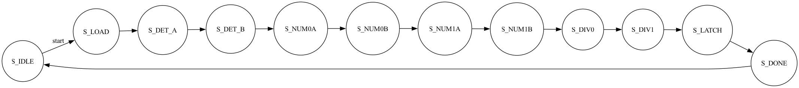

# 2×2 Matrix Inversion Solver (Q4.4 Fixed-Point)

This project is a high-efficiency hardware solver for **2×2 linear systems** of the form:

    Ax = b

It is optimized for **TinyTapeout** and designed to fit within **one tile**.  
The architecture uses a **sequential datapath**, a **shared 13-bit accumulator**, and a **restoring divider** to minimize area.

---

# Mathematical Model

The solver computes the algebraic solution for:

    A = | a  b |
        | c  d |

    b = | e |
        | f |

The system solution is:

    det = ad − bc

    x0 = (de − bf) / det
    x1 = (af − ce) / det

---

# Optimized Datapath

To keep the design small enough for TinyTapeout, the solver uses a **sequential compute architecture**.

### Shared Multiplier
A single **4×4 signed multiplier** is reused across **6 cycles** to compute all intermediate products.

### Accumulator-Based Math
A **13-bit signed accumulator (`acc`)** performs the required subtractions:

    ad − bc
    de − bf
    af − ce

### Restoring Divider
A **13-bit ÷ 9-bit sequential restoring divider** computes `x0` and `x1`.

### Register Reuse
Output registers

    x0_r
    x1_r

temporarily store numerators to reduce flip-flop count.

---

# FSM Logic Flow

The solver runs on a **12-state finite state machine** that schedules the shared hardware resources.

---

# Pinout Mapping

| Pin | Direction | Description |
|----|----|----|
| `ui_in[3:0]` | Input | 4-bit signed input stream (`a,b,c,d,e,f`) |
| `uio_in[0]` | Input | Start pulse |
| `uio_in[1]` | Input | Output select (`0=x0`, `1=x1`) |
| `uo_out[7:0]` | Output | Q4.4 signed result |
| `uio_out[0]` | Output | Result valid |
| `uio_out[1]` | Output | Singular matrix (`det = 0`) |
| `uio_out[2]` | Output | Overflow indicator |

---

# How to Use

## 1. Loading Data

Pulse `uio_in[0]` high.

Provide inputs sequentially:

    cycle 0 : a
    cycle 1 : b
    cycle 2 : c
    cycle 3 : d
    cycle 4 : e
    cycle 5 : f

Each value is a **4-bit signed integer**.

---

## 2. Computation

After loading finishes, the solver automatically executes:

    6 MAC cycles
    2 division phases (~13 cycles each)

Total latency:

    ~45 cycles

---

## 3. Reading Results

When

    uio_out[0] = 1

the results are ready.

Select output:

    uio_in[1] = 0 → read x0
    uio_in[1] = 1 → read x1

The output is **Q4.4 fixed point**.

Convert to float:

    result / 16.0

---

# Technical Specifications

Number Format:

    Signed Q4.4
    Range: -8.0 to 7.9375

Latency:

    ~45 clock cycles per solve

Overflow Handling:

    Positive overflow → 0x7F
    Negative overflow → 0x80

---

# Use of GenAI

This project was developed with assistance from **Gemini 3 Flash**.

AI assistance was used to:

• Optimize RTL from a parallel design to a **sequential accumulator architecture**  
• Debug **signed arithmetic promotion issues**  
• Fix **FSM race conditions**  
• Refactor the **Cocotb testbench** for variable-latency handshaking  
• Analyze synthesis logs to remove redundant register bits
